# JisNow

JisNow is a Flutter mobile application for electric vehicle rental. The project was created as a school project and focuses on helping users find, book, and manage electric mobility services through a simple app interface.

## Project Objective

The goal of this project is to build a modern rental platform for electric vehicles such as bikes and scooters. The app is designed to support both customers and administrators by providing booking features, account management, and vehicle management tools.

## Main Features

- User login with Google Sign-In and Firebase Authentication
- Browse available electric vehicles
- Search and filter vehicles
- Book a vehicle and manage booking flow
- View notifications inside the app
- Contact support through chat
- Admin tools for managing vehicles and bookings
- Google Maps support for location-based features

## App Screenshots

These are the current app screenshots from the project build.

| Screen 1 | Screen 2 | Screen 3 |
| --- | --- | --- |
| 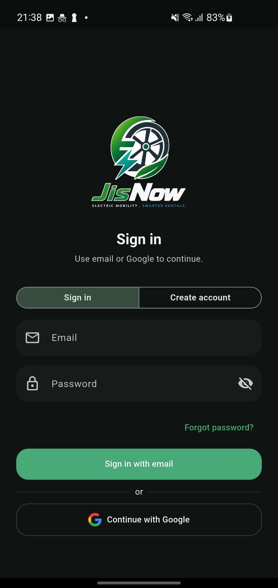 | 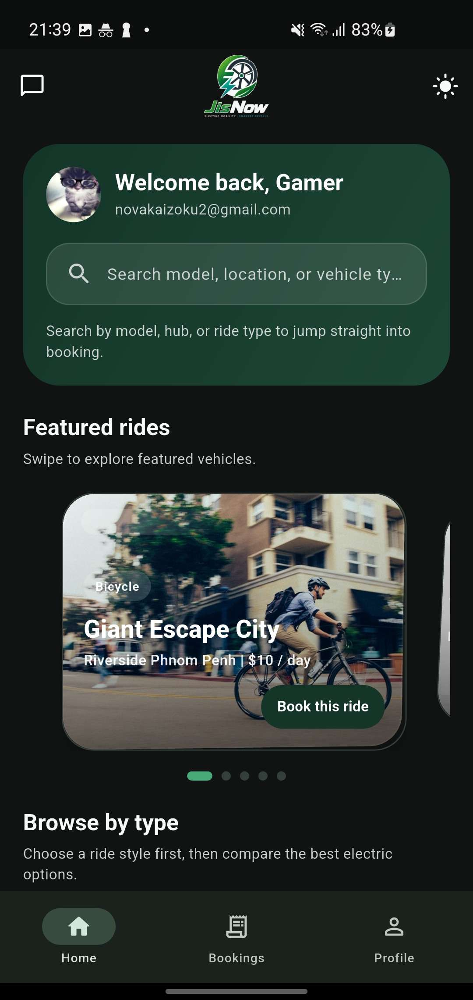 | 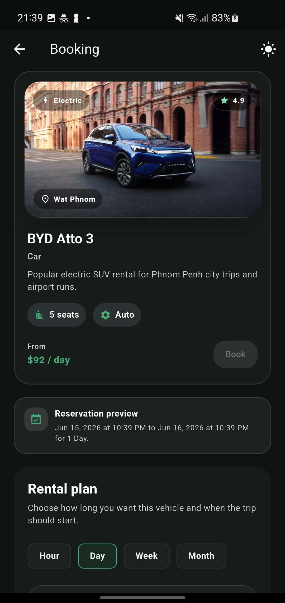 |

| Screen 4 | Screen 5 | Screen 6 |
| --- | --- | --- |
| 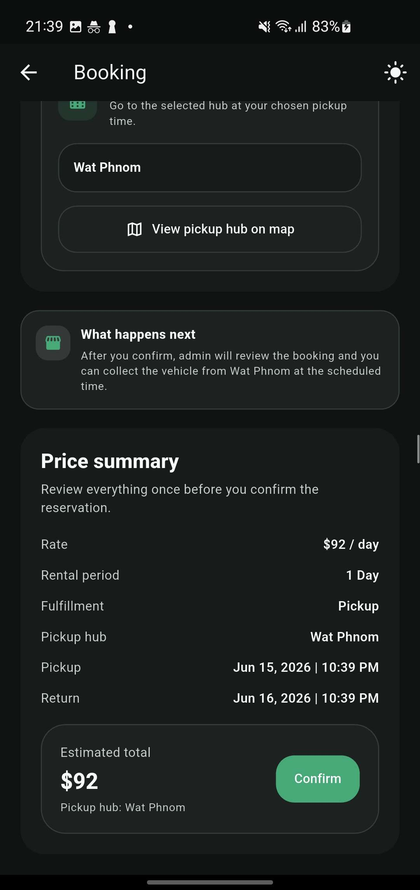 | 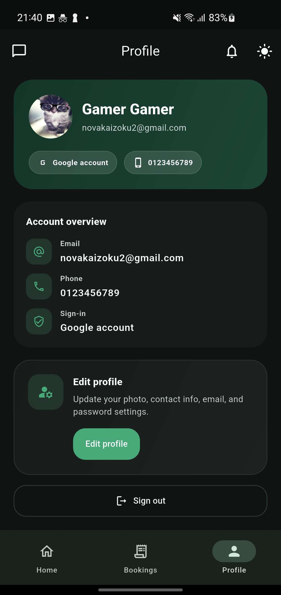 | 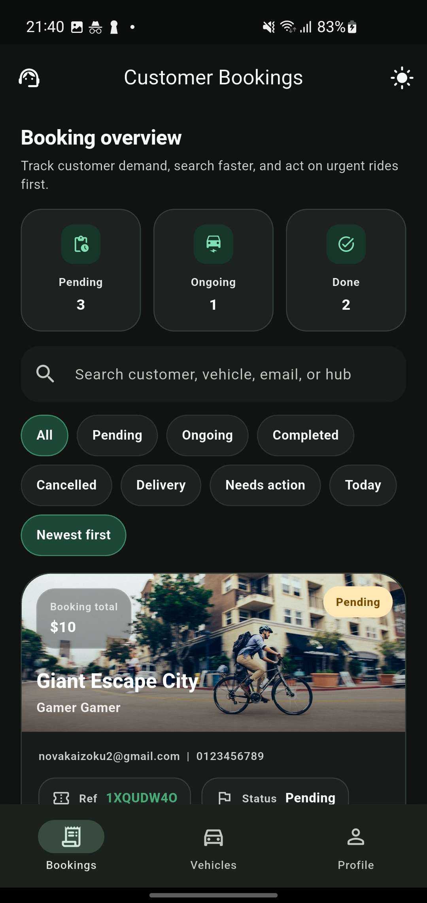 |

| Screen 7 | Screen 8 | Screen 9 |
| --- | --- | --- |
| 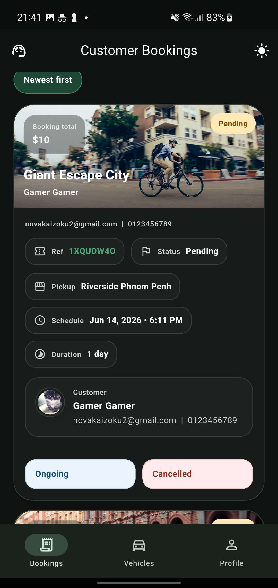 | 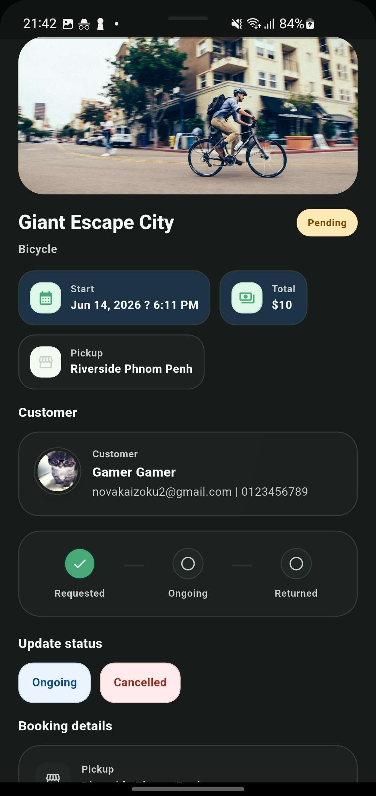 | 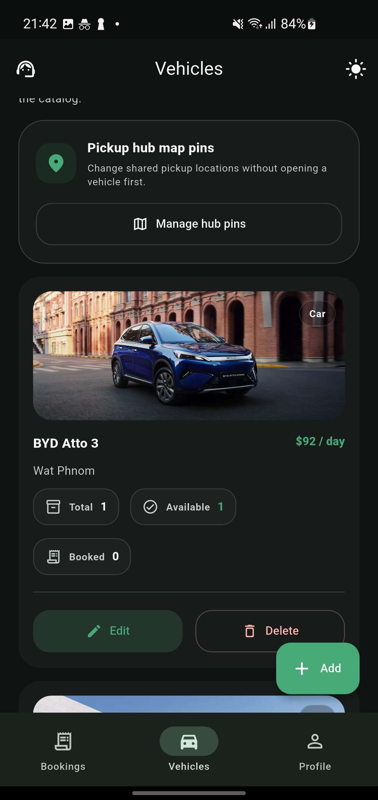 |

| Screen 10 | Screen 11 | Screen 12 |
| --- | --- | --- |
| 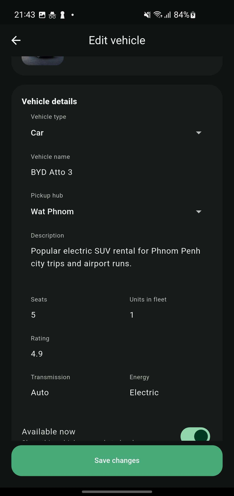 | 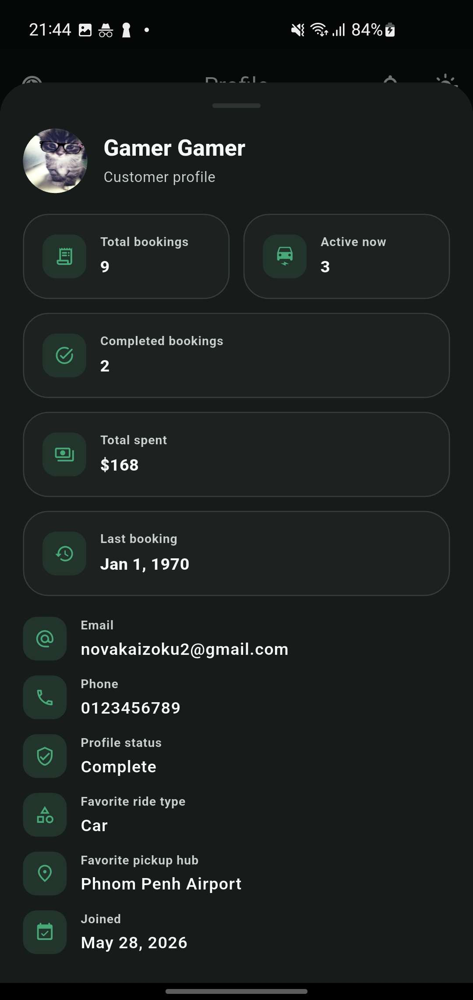 | 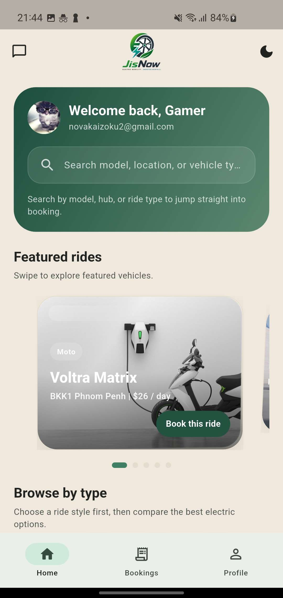 |

## Tools And Technologies

- Flutter
- Dart
- Firebase Authentication
- Cloud Firestore
- Cloud Functions
- Firebase Storage
- Google Maps Flutter

## Project Structure

```text
lib/
  data/        Demo data
  models/      Data models
  screens/     App pages and flows
  services/    Firebase and business logic
  theme/       Colors and app theme
  widgets/     Reusable UI components

assets/
  branding/    Logos and app branding
  vehicles/    Vehicle images

functions/     Firebase Cloud Functions
android/       Android project files
ios/           iOS project files
web/           Web platform files
windows/       Windows platform files
linux/         Linux platform files
macos/         macOS platform files
```

## How To Run The Project

1. Clone the repository.
2. Open the project in VS Code or Android Studio.
3. Install Flutter dependencies:

```bash
flutter pub get
```

4. If you want to use Firebase Functions, install the Node.js dependencies:

```bash
cd functions
npm install
cd ..
```

5. Run the application:

```bash
flutter run
```

## Requirements

- Flutter SDK
- Dart SDK
- Android Studio or VS Code
- Git
- Firebase CLI for backend deployment if needed

## Important Files

- `lib/main.dart` - application entry point
- `lib/screens/` - main user interface screens
- `lib/services/` - app logic and Firebase communication
- `functions/index.js` - backend cloud functions
- `pubspec.yaml` - dependencies and Flutter asset setup

## Notes For Teacher

- This project is built mainly with Flutter and Firebase.
- The repository includes both frontend app code and backend Firebase Functions code.
- Android Firebase configuration is already included for project testing.
- Some platforms are present because they are generated by Flutter, but Android is the primary configured platform in the current project state.

## Author

Members:

- Heng Ratana
- Chay Chantha

Subject: Mobile App Development II

Teacher: Oum Saokosal

Submission Date: 16 June 2026
